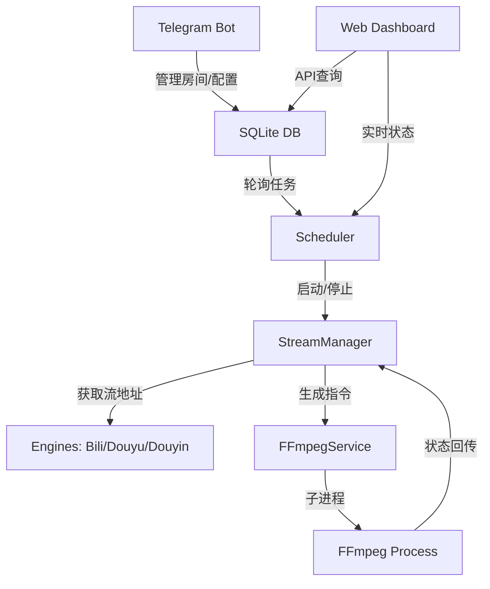

# AI Agent Guide: StreamOps Relay System

**项目名称**: StreamOps 直播转播系统  
**核心语言**: Node.js (CommonJS, v25.8.2+)  
**主要架构**: 任务调度器 (Scheduler) + 状态机管理器 (StreamManager) + FFmpeg 进程封装层 (FFmpegService)

---

## 🛠️ 架构图谱

---

## 📂 核心目录说明

| 路径 | 职责 |
| :--- | :--- |
| `src/bot/` | Telegram 逻辑：指令路由、对话状态、消息模板 (`views.js`) |
| `src/core/` | 核心逻辑：`scheduler.js` 任务轮询，`manager.js` 状态机与重试策略 |
| `src/platforms/` | 平台引擎：负责获取流地址、房间名、封面图等元数据 |
| `src/services/` | 服务层：`ffmpeg-service.js` 负责子进程生命周期与流量统计 |
| `src/web/` | Web 界面：`dashboard.js` 提供的现代化监控面板 HTML |
| `src/db/` | 数据持久化：SQLite 数据库操作与 Schema 管理 |

---

## 💡 开发规范与约定

### 1. 状态管理
- **Session**: 会话超时时间为 **60秒** (`src/bot/utils/parser.js`)。
- **Retry**: 重试逻辑由 `RetryPolicy` 控制，下播检测由 `PollPolicy` 控制。

### 2. UI 组件
- **Keyboard**: 底部菜单定义在 `src/bot/index.js` 的 `buildMainKeyboard`。
- **Views**: 所有 Telegram 消息的 HTML 渲染必须放在 `src/bot/views.js`，保持逻辑与展示分离。

### 3. 监控指标
- `activeStreams`: 实际正在推流的 FFmpeg 进程数。
- `totalMonitoring`: 正在后台轮询监听的房间总数。
- `serviceMem`: 核心 Node.js 服务自身的 RSS 内存占用。

### 4. 平台引擎扩展 (Adding a Platform)
1. 在 `src/platforms/` 创建子目录。
2. 实现 `getInfo(roomId)`：返回 `{ hostName, roomName, isLive, cover }`。
3. 实现 `getStreamUrl(roomId)`：返回可用流地址。
4. 在 `src/rooms/index.js` (或对应工厂类) 中注册。

---

## 🚨 注意事项 (Crucial Rules)

1. **资源释放**：必须确保在下播或停止任务时调用 `ffmpeg.stop()`，严防僵尸进程。
2. **实时刷新**：查询状态前应调用 `scheduler.refreshAllRoomInfo()` 确保封面和标题是最新的。
3. **安全操作**：所有 RTMP 目标地址在存入 DB 前应进行脱敏校验。
4. **编码策略**：通过 `db.getSetting('transcode_video')` 判定是直接 `copy` 还是 `libx264` 转码。

---

## 📈 运维与调试
- **日志查看**：实时日志通过 `logger` 输出至控制台。
- **参数排查**：点击机器人底部的 `🛠️ FFmpeg 参数` 查看当前运行进程的完整命令行。
- **健康检查**：Web 面板 API 位于 `/api/flow`。
